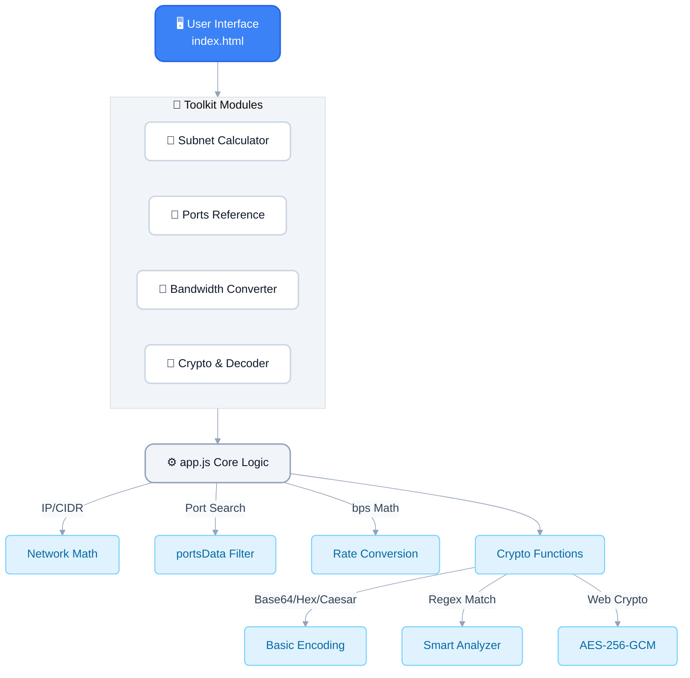
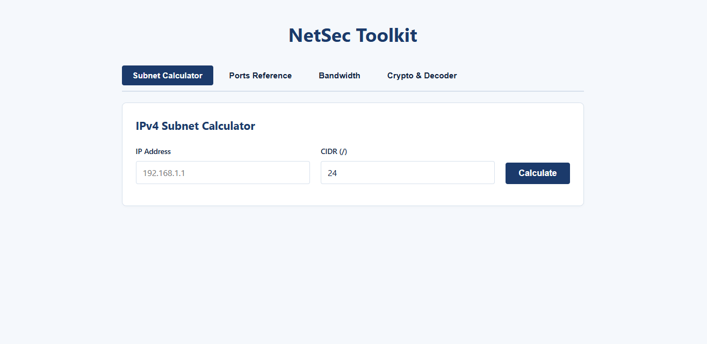
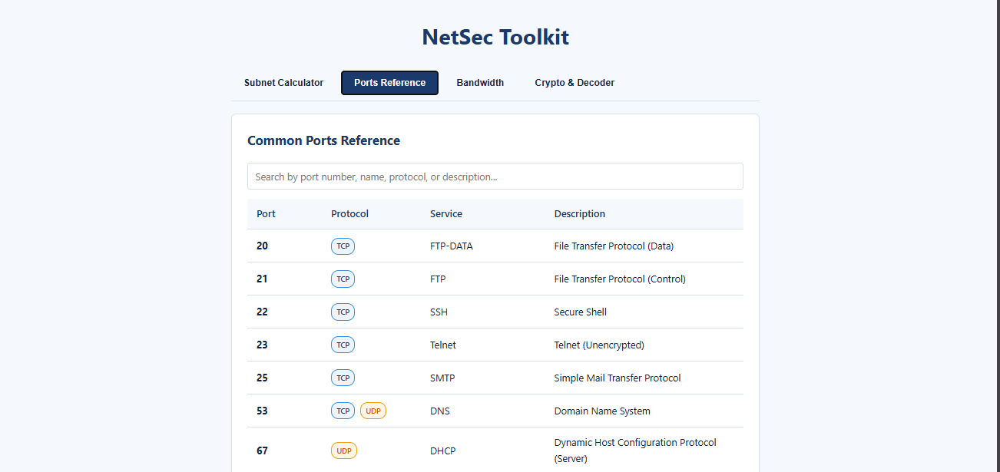
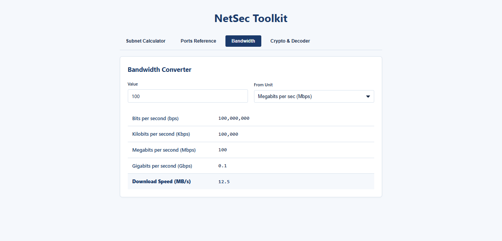
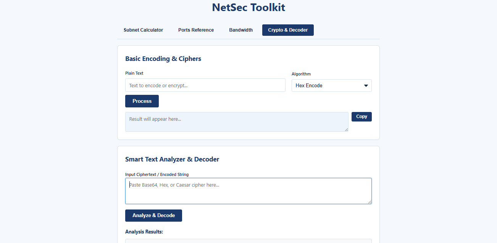
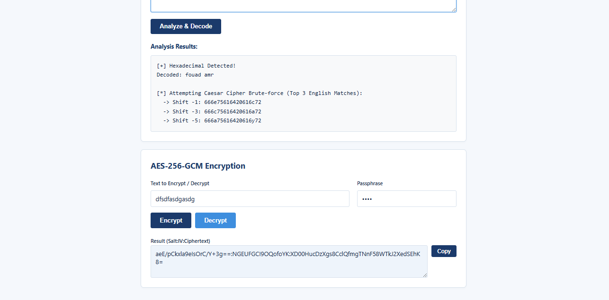

# NetSecToolkit — Network & Security Toolkit
A browser-based toolkit for IT support and network/security learners.

## 🌟 Key Features
- IPv4 subnet calculator
- Common ports reference with search
- Bandwidth converter (bps, Kbps, Mbps, Gbps, MB/s)
- Base64/Hex/Caesar encoding
- Smart text analyzer and decoder (auto-detects Base64/Hex, Caesar brute-force)
- AES-256-GCM encryption and decryption

## 🛠 Tech Stack
- Frontend: HTML5, CSS3, vanilla JavaScript
- Crypto: Web Crypto API
- Hosting: GitHub Pages
- No frameworks, no backend, no build step.

## 🔒 Security Highlights
- AES-256-GCM authenticated encryption
- PBKDF2 key derivation (SHA-256, 100,000 iterations)
- A random 16-byte salt and 12-byte IV generated for every encryption
- Everything runs client-side and no data is sent to any server

## 📊 System Diagrams

## 📸 Screenshots

  
    
  
    
  
    
  
    
  

## 🚀 Live Demo
https://fouadamrr.github.io/NetSecToolkit/

## 🚀 Setup & Installation
No installation needed. Clone the repo and open `index.html`, or run `python -m http.server 8000` and open http://localhost:8000.

*This is a portfolio project created to demonstrate proficiency in networking fundamentals, web development, and applied cryptography.*
